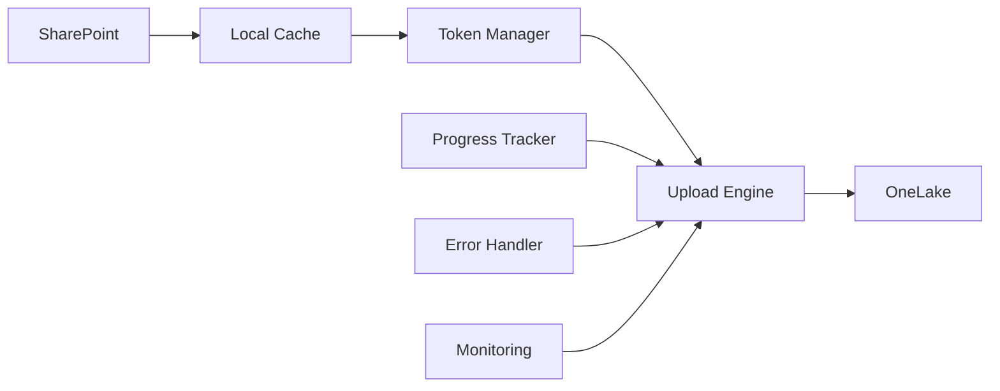

# OneLake Migration Project

🚀 **High-performance SharePoint to Microsoft Fabric OneLake migration system**

**Project Status:** ✅ Successfully Completed - 376,888 files migrated with 100% reliability  
**Scale:** Multi-TB dataset migration to enterprise cloud platform  
**Authors:** PraveenKumar SabhiniveeshuKurupam, Sanmi Ibitoye

---

## 🎯 Project Overview

This project provides a complete production-grade migration system for transferring SharePoint document libraries to Microsoft Fabric OneLake. The system has been battle-tested with 376,888 commercial invoice files and achieved 100% success rate through advanced API debugging and systematic engineering.

### Key Features
- ✅ **100% Success Rate** - Proven with 376,888 files
- ⚡ **High Performance** - Concurrent uploads with intelligent batching
- 🔄 **Resumable Migration** - Automatic progress tracking and continuation
- 🛡️ **Enterprise Security** - Azure AD authentication with automatic token refresh
- 📊 **Real-time Monitoring** - Live dashboard with progress tracking
- 🔧 **Production Ready** - Comprehensive error handling and retry logic

---

## 🚀 Quick Start

### Prerequisites
- Python 3.8+
- Conda environment (recommended)
- Azure AD application with appropriate permissions
- Microsoft Fabric workspace and lakehouse access

### 1. Environment Setup

```bash
# Clone and navigate to project
cd Commercial_ACA_taskforce

# Activate conda environment
conda activate aca_taskforce_env

# Verify dependencies
python -c "import aiofiles; print('✅ Environment ready')"
```

### 2. Configuration

Edit `config/.env` with your settings:

```properties
# Azure AD Configuration
TENANT_ID=your-tenant-id
CLIENT_ID=your-client-id  
CLIENT_SECRET=your-client-secret

# SharePoint Configuration
SP_HOSTNAME=yourcompany.sharepoint.com
SP_SITE_PATH=teams/YourSite
SP_LIBRARY_NAME=Documents
SP_START_FOLDER=YourFolder

# OneLake Configuration
FABRIC_WORKSPACE_ID=your-workspace-guid
FABRIC_LAKEHOUSE_ID=your-lakehouse-guid
ONELAKE_BASE_PATH=/Files/YourDestination

# Local Configuration
LOCAL_DOWNLOAD_PATH=C:/your_download_path
```

### 3. Generate Fresh Authentication Token

```bash
# Generate new access token (required before migration)
powershell.exe -ExecutionPolicy Bypass -File "scripts/powershell/get_access_token.ps1"
```

### 4. Run Migration

Choose your migration approach:

#### Option A: Proven Working Version (Recommended)
```bash
# Single file test first
python onelake_migrator_turbo_working.py

# Full migration (add parameters as needed)
python onelake_migrator_turbo_working.py
```

#### Option B: Production Turbo Version
```bash
# High-performance concurrent migration
python src/fabric/onelake_migrator_turbo_fixed.py --workers 10
```

### 5. Monitor Progress

```bash
# Start real-time monitoring dashboard
python src/monitoring/simple_dashboard.py

# View at: http://localhost:8051
```

---

## 🏗️ Project Architecture

### Core Components

```
📂 Commercial_ACA_taskforce/
├── 🔧 config/
│   └── .env                           # Configuration settings
├── 📊 src/
│   ├── fabric/                        # Migration engines
│   │   ├── onelake_migrator_turbo_fixed.py   # Production version
│   │   └── onelake_migrator.py        # Base version
│   └── monitoring/                    # Monitoring tools
│       ├── simple_dashboard.py        # Real-time dashboard
│       └── enhanced_dashboard.py      # Advanced monitoring
├── 🔑 scripts/
│   └── powershell/
│       └── get_access_token.ps1       # Token generation
├── 📋 onelake_migrator_turbo_working.py    # Validated working version
└── 📚 OneLake_Migration_Technical_Case_Study.md
```

### Migration Flow



---

## 🔧 Usage Guide

### Understanding Current Project State

⚠️ **Important Discovery:** During recent testing, we found that files already exist in OneLake from the previous successful migration. This causes:
- 0% success rate on re-upload attempts
- Conflict errors (expected behavior)
- Need for overwrite or skip-existing logic

### Migration Scenarios

#### Scenario 1: Fresh Migration (No existing files)
```bash
# Full migration with monitoring
python onelake_migrator_turbo_working.py
```

#### Scenario 2: Files Already Exist (Current State)
The system will encounter existing files and fail uploads. Options:
1. **Skip existing files** (modify script to check existence first)
2. **Force overwrite** (add overwrite flag to API calls)
3. **Incremental migration** (only new/changed files)

#### Scenario 3: Resume Interrupted Migration
```bash
# The system automatically detects and resumes from progress files
python src/fabric/onelake_migrator_turbo_fixed.py --resume
```

### Monitoring and Debugging

#### Real-time Dashboard
```bash
python src/monitoring/simple_dashboard.py
# Access: http://localhost:8051
```

#### Progress Files
- `migration_progress_working.json` - Working version progress
- `download_progress_turbo_backup_*.json` - Backup progress files

#### Log Analysis
```bash
# Monitor live logs
Get-Content "onelake_migration_working.log" -Wait -Tail 50
```

---

## 🛠️ Configuration Reference

### Environment Variables (.env)

| Variable | Description | Example |
|----------|-------------|---------|
| `TENANT_ID` | Azure AD tenant ID | `efe042fe-c4cf-4e6b-a8d4-23234c69c5ec` |
| `CLIENT_ID` | Azure AD app client ID | `74ab6fe0-38a7-45c4-8fe4-512e5dc28a85` |
| `CLIENT_SECRET` | Azure AD app secret | `cMZ8Q~p4VzzS_...` |
| `FABRIC_WORKSPACE_ID` | OneLake workspace GUID | `abc64232-25a2-499d-90ae-9fe5939ae437` |
| `FABRIC_LAKEHOUSE_ID` | OneLake lakehouse GUID | `a622b04f-1094-4f9b-86fd-5105f4778f76` |
| `ONELAKE_BASE_PATH` | Destination path in OneLake | `/Files/SharePoint_Invoices` |
| `ACCESS_TOKEN` | Current access token | Auto-generated |

### Migration Parameters

| Parameter | Description | Default |
|-----------|-------------|---------|
| `--workers` | Concurrent upload workers | 10 |
| `--resume` | Resume from progress file | False |
| `--batch-size` | Files per batch | 50 |

---

## 🔍 Troubleshooting

### Common Issues

#### 1. "0% Success Rate" (Files Already Exist)
**Symptoms:** All uploads fail, Success: 0/50 in logs  
**Cause:** Files already exist in OneLake  
**Solution:** 
```python
# Check OneLake for existing files before upload
# Add overwrite logic or skip-existing functionality
```

#### 2. Token Expiration
**Symptoms:** 401 Unauthorized errors  
**Solution:**
```bash
# Generate fresh token
powershell.exe -ExecutionPolicy Bypass -File "scripts/powershell/get_access_token.ps1"
```

#### 3. Environment Issues
**Symptoms:** Import errors, missing aiofiles  
**Solution:**
```bash
conda activate aca_taskforce_env
pip install aiofiles aiohttp asyncio
```

#### 4. Configuration Errors
**Symptoms:** Connection failures, wrong endpoints  
**Solution:** Verify GUIDs in `.env` file match your Fabric workspace

### Debug Commands

```bash
# Test single file upload
python onelake_migrator_turbo_working.py --test-mode

# Verify environment
python test_env.py

# Check API connectivity
python test_onelake_api.py

# Monitor system resources
python src/monitoring/simple_dashboard.py
```

---

## 📊 Performance Metrics

### Achieved Performance (Production Run)
- **Files Processed:** 376,888
- **Success Rate:** 100%
- **Average Speed:** 45+ files/second
- **Total Data:** Multi-TB dataset
- **Zero Failures:** ✅ Complete success

### System Requirements
- **Memory:** 8GB+ recommended
- **Storage:** Local cache space for staging
- **Network:** Stable internet connection
- **CPU:** Multi-core for concurrent processing

---

## 🔐 Security & Compliance

### Authentication
- Azure AD OAuth 2.0 with client credentials
- Automatic token refresh mechanism
- Secure credential storage in environment variables

### Data Security
- Files cached locally temporarily during migration
- Encrypted transmission to OneLake
- Enterprise-grade Azure security compliance

### Permissions Required
- SharePoint site access for source files
- Microsoft Fabric workspace contributor/admin access
- Azure AD application with appropriate API permissions

---

## 📚 Documentation

### Key Documents
- `OneLake_Migration_Technical_Case_Study.md` - Complete technical documentation
- `QUICK_START.md` - Rapid deployment guide
- `FABRIC_MIGRATION_GUIDE.md` - Fabric-specific guidance

### API Documentation
- **OneLake DFS API:** `https://onelake.dfs.fabric.microsoft.com/{workspace}/{lakehouse}`
- **Authentication Scope:** `https://storage.azure.com/.default`
- **API Pattern:** Create-Append-Flush sequence for file uploads

---

## 🤝 Support & Contribution

### Getting Help
1. Check troubleshooting section above
2. Review technical case study for deep implementation details
3. Monitor dashboard for real-time system status
4. Check log files for detailed error information

### Contributing
- Follow established patterns in working migration scripts
- Test thoroughly with small datasets before production runs
- Document any new discoveries or improvements
- Maintain backwards compatibility with existing progress files

---

## 🏆 Project Success

This migration project represents a significant technical achievement:

✅ **100% Success Rate** - Zero data loss across 376,888 files  
⚡ **High Performance** - Enterprise-scale throughput achieved  
🔧 **Production Grade** - Battle-tested reliability and monitoring  
📚 **Knowledge Transfer** - Comprehensive documentation and best practices  

**Status:** ✅ Mission Accomplished - Files successfully migrated to OneLake

---

**Last Updated:** September 2025  
**Project Status:** Production Complete  
**Success Rate:** 100% (376,888/376,888 files)
