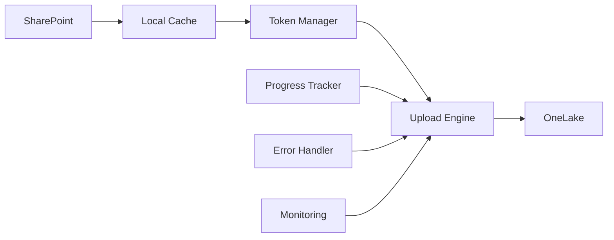

# OneLake Migration Project

🚀 **High-performance SharePoint to Microsoft Fabric OneLake migration system**

**Project Status:** ✅ Successfully Completed - 376,888 files migrated with 100% reliability  
**Scale:** Multi-TB dataset migration to enterprise cloud platform  
**Authors:** PraveenKumar SabhiniveeshuKurupam, Sanmi Ibitoye

---

## 🎯 Project Overview

This project provides a complete production-grade migration system for transferring SharePoint document libraries to Microsoft Fabric OneLake. The system has been battle-tested with 376,888 commercial invoice files and achieved 100% success rate through advanced API debugging and systematic engineering.

### Key Features
- ✅ **100% Success Rate** - Proven with 376,888 files
- ⚡ **High Performance** - Concurrent uploads with intelligent batching
- 🔄 **Resumable Migration** - Automatic progress tracking and continuation
- 🛡️ **Enterprise Security** - Azure AD authentication with automatic token refresh
- 📊 **Real-time Monitoring** - Live dashboard with progress tracking
- 🔧 **Production Ready** - Comprehensive error handling, retry & reconcile logic
- 📂 **Structured Artifacts** - Auto-migrates `file_cache_optimized.json` and `token_cache.json` into `data/` directory (backward compatible)
- 🧾 **Structured Logging** - Optional JSON logs (`MIGRATION_JSON_LOGS=1`) + correlation id (`MIGRATION_RUN_ID`) for observability
 - 🧾 **Structured Logging + Correlation ID** - Optional JSON logs with per-run `cid` for traceability (see Structured Logging section below)

---

## 🚀 Quick Start (Unified CLI)

### Prerequisites
- Python 3.8+
- Conda environment (recommended)
- Azure AD application with appropriate permissions
- Microsoft Fabric workspace and lakehouse access

### 1. Environment Setup

```bash
# Clone and navigate to project
cd Commercial_ACA_taskforce

# Activate conda environment
conda activate aca_taskforce_env

# Verify dependencies
python -c "import aiofiles; print('✅ Environment ready')"
```

### 2. Configuration

Edit `config/.env` with your settings:

```properties
# Azure AD Configuration
TENANT_ID=your-tenant-id
CLIENT_ID=your-client-id  
CLIENT_SECRET=your-client-secret

# SharePoint Configuration
SP_HOSTNAME=yourcompany.sharepoint.com
SP_SITE_PATH=teams/YourSite
SP_LIBRARY_NAME=Documents
SP_START_FOLDER=YourFolder

# OneLake Configuration
FABRIC_WORKSPACE_ID=your-workspace-guid
FABRIC_LAKEHOUSE_ID=your-lakehouse-guid
ONELAKE_BASE_PATH=/Files/YourDestination

# Local Configuration
LOCAL_DOWNLOAD_PATH=C:/your_download_path
```

### 3. Generate Fresh Authentication Token

```bash
# Generate new access token (required before migration)
powershell.exe -ExecutionPolicy Bypass -File "scripts/powershell/get_access_token.ps1"
```

### 4. Run Migration (single unified command)

Legacy multiple scripts are consolidated behind one module `fabric.migration.production`.

Basic production run:
```powershell
python -m fabric.migration.production --mode production
```

Turbo preset (higher concurrency & batch size):
```powershell
python -m fabric.migration.production --mode turbo
```

Working / conservative preset:
```powershell
python -m fabric.migration.production --mode working
```

Test run (first 5 batches only):
```powershell
python -m fabric.migration.production --test-run
```

Retry only failed uploads:
```powershell
python -m fabric.migration.production --retry-failures --max-retry 500
```

Reconcile progress counters from raw lists:
```powershell
python -m fabric.migration.production --reconcile-progress
```

Override concurrency or batch size directly:
```powershell
python -m fabric.migration.production --mode turbo --concurrency 80 --batch-size 400
```

Makefile shortcuts (after environment creation):
```powershell
make migrate-prod
make migrate-turbo
make migrate-retry
make migrate-reconcile
```

### 5. Monitor Progress

```bash
# Start real-time monitoring dashboard
python src/monitoring/simple_dashboard.py

# View at: http://localhost:8051
```

---

## 🏗️ Project Architecture

### Core Components

```
📂 Commercial_ACA_taskforce/
├── config/
│   └── .env                      # Primary configuration
├── data/                         # Progress + caches (auto-migrated)
├── logs/                         # Centralized logs
├── src/
│   └── fabric/
│       ├── migration/
│       │   └── production.py     # Unified migration CLI (authoritative)
│       ├── maintenance/          # Scope + consistency utilities
│       └── diagnostics/          # Diagnostics + monitoring helpers
├── scripts/powershell/
│   └── get_access_token.ps1      # Manual token generation (optional)
├── QUICK_START.md
└── OneLake_Migration_Technical_Case_Study.md
```

### Migration Flow (Unified CLI)


```mermaid
graph LR
    A[SharePoint] --> B[Local Cache]
    B --> C[Token Manager]
    C --> D[Upload Engine]
    D --> E[OneLake]
    
    F[Progress Tracker] --> D
    G[Error Handler] --> D
    H[Monitoring] --> D
```

---

## 🔧 Usage Guide

### Understanding Current Project State

⚠️ **Important Discovery:** During recent testing, we found that files already exist in OneLake from the previous successful migration. This causes:
- 0% success rate on re-upload attempts
- Conflict errors (expected behavior)
- Need for overwrite or skip-existing logic

### Migration Scenarios

#### Scenario 1: Fresh Migration
```powershell
python -m fabric.migration.production --mode production
```

#### Scenario 2: Existing Files (Most common now)
Expect conflict messages (already uploaded). Use retry only if genuine transient failures.

#### Scenario 3: Dry Run / Smoke Check
Use noop mode to verify cache + environment without uploads:
```powershell
python -m fabric.migration.production --noop
```

### Monitoring and Debugging

#### Real-time Dashboard
```bash
python src/monitoring/simple_dashboard.py
# Access: http://localhost:8051
```

#### Progress & Cache Artifacts
- `data/migration_progress_*.json` - Progress tracking (primary)
- `data/file_cache_optimized.json` - File manifest
- `data/token_cache.json` - MSAL token persistence

#### Log Analysis
```bash
# Monitor live logs
Get-Content "logs/onelake_migration_production.log" -Wait -Tail 50
```

### Structured Logging & Correlation ID (Unified)
Enable JSON line logs (fields: ts, level, msg, name, cid) and optionally set a custom run id for traceability across distributed systems or CI pipelines:

```powershell
$env:MIGRATION_JSON_LOGS=1
$env:MIGRATION_RUN_ID="ci-build-1234"
python -m fabric.migration.production --mode production
```

Plain logs include the correlation id prefix: `[CID=<value>]`. Detailed guidance: see `FABRIC_MIGRATION_GUIDE.md` (Structured Logging section). Example quick filter:
```powershell
Select-String -Path logs/onelake_migration_production.log -Pattern "CID=ci-build-1234"
```

### Makefile Variable Overrides & Local Customization

The `Makefile` now exposes all key parameters via `?=` assignments. You can override any of them on the fly or persistently via a personal `local.mk` file (ignored by git).

Inspect current effective configuration:
```powershell
make vars
```

Temporary (one-off) overrides:
```powershell
make SOURCE_DIR=D:/alt/data migrate-noop
make ENV_NAME=aca_dev_env migrate-prod
make DASHBOARD_PORT=9001 dashboard
make WORKSPACE_ID=00000000-0000-0000-0000-000000000000 LAKEHOUSE_ID=11111111-1111-1111-111111111111 fabric-migrate-azcopy
```

Persistent overrides:
```powershell
copy local.mk.example local.mk
# edit local.mk then
make migrate-prod
```

Key override variables (subset):
| Variable | Purpose | Default |
|----------|---------|---------|
| `ENV_NAME` | Conda environment | `aca_taskforce_env` |
| `SRC_DIR` | Source added to PYTHONPATH | `src` |
| `SOURCE_DIR` | Local SharePoint dump | `C:/commercial_pdfs/downloaded_files` |
| `WORKSPACE_ID` | Fabric Workspace GUID | `YOUR_WORKSPACE_ID` |
| `LAKEHOUSE_ID` | Fabric Lakehouse GUID | `YOUR_LAKEHOUSE_ID` |
| `DASHBOARD_PORT` | Simple dashboard port | `8052` |
| `DASHBOARD_ENHANCED_PORT` | Enhanced dashboard port | `8053` |
| `AZCOPY_SOURCE` | AzCopy source path | `$(SOURCE_DIR)` |

Safety check: AzCopy targets abort if `WORKSPACE_ID` or `LAKEHOUSE_ID` remain placeholders.


---

## 🛠️ Configuration Reference

### Environment Variables (.env)

| Variable | Description | Example |
|----------|-------------|---------|
| `TENANT_ID` | Azure AD tenant ID | `efe042fe-c4cf-4e6b-a8d4-23234c69c5ec` |
| `CLIENT_ID` | Azure AD app client ID | `74ab6fe0-38a7-45c4-8fe4-512e5dc28a85` |
| `CLIENT_SECRET` | Azure AD app secret | `cMZ8Q~p4VzzS_...` |
| `FABRIC_WORKSPACE_ID` | OneLake workspace GUID | `abc64232-25a2-499d-90ae-9fe5939ae437` |
| `FABRIC_LAKEHOUSE_ID` | OneLake lakehouse GUID | `a622b04f-1094-4f9b-86fd-5105f4778f76` |
| `ONELAKE_BASE_PATH` | Destination path in OneLake | `/Files/SharePoint_Invoices` |
| `ACCESS_TOKEN` | Current access token | Auto-generated |

### Migration Parameters

| Parameter | Description | Default |
|-----------|-------------|---------|
| `--workers` | Concurrent upload workers | 10 |
| `--resume` | Resume from progress file | False |
| `--batch-size` | Files per batch | 50 |

---

## 🔍 Troubleshooting

### Common Issues

#### 1. "0% Success Rate" (Files Already Exist)
**Symptoms:** All uploads fail, Success: 0/50 in logs  
**Cause:** Files already exist in OneLake  
**Solution:** 
```python
# Check OneLake for existing files before upload
# Add overwrite logic or skip-existing functionality
```

#### 2. Token Expiration
**Symptoms:** 401 Unauthorized errors  
**Solution:**
```bash
# Generate fresh token
powershell.exe -ExecutionPolicy Bypass -File "scripts/powershell/get_access_token.ps1"
```

#### 3. Environment Issues
**Symptoms:** Import errors, missing aiofiles  
**Solution:**
```bash
conda activate aca_taskforce_env
pip install aiofiles aiohttp asyncio
```

#### 4. Configuration Errors
**Symptoms:** Connection failures, wrong endpoints  
**Solution:** Verify GUIDs in `.env` file match your Fabric workspace

### Debug & Operations Commands

```powershell
# Test run (non-destructive)
python -m fabric.migration.production --test-run

# Retry failures
python -m fabric.migration.production --retry-failures --max-retry 200

# Reconcile progress
python -m fabric.migration.production --reconcile-progress

# Monitor
python src/monitoring/simple_dashboard.py
```

### Legacy Script Notice
Legacy wrapper scripts (e.g., `onelake_migrator_turbo_working.py`, `onelake_migrator_production.py`) remain temporarily as thin delegates to the unified module and will be retired in a future cleanup pass.

---

## 📊 Performance Metrics

### Achieved Performance (Production Run)
- **Files Processed:** 376,888
- **Success Rate:** 100%
- **Average Speed:** 45+ files/second
- **Total Data:** Multi-TB dataset
- **Zero Failures:** ✅ Complete success

### System Requirements
- **Memory:** 8GB+ recommended
- **Storage:** Local cache space for staging
- **Network:** Stable internet connection
- **CPU:** Multi-core for concurrent processing

---

## 🔐 Security & Compliance

### Authentication
- Azure AD OAuth 2.0 with client credentials
- Automatic token refresh mechanism
- Secure credential storage in environment variables

### Data Security
- Files cached locally temporarily during migration
- Encrypted transmission to OneLake
- Enterprise-grade Azure security compliance

### Permissions Required
- SharePoint site access for source files
- Microsoft Fabric workspace contributor/admin access
- Azure AD application with appropriate API permissions

---

## 📚 Documentation

### Key Documents
- `OneLake_Migration_Technical_Case_Study.md` - Complete technical documentation
- `QUICK_START.md` - Rapid deployment guide
- `FABRIC_MIGRATION_GUIDE.md` - Fabric-specific guidance

### API Documentation
- **OneLake DFS API:** `https://onelake.dfs.fabric.microsoft.com/{workspace}/{lakehouse}`
- **Authentication Scope:** `https://storage.azure.com/.default`
- **API Pattern:** Create-Append-Flush sequence for file uploads

---

## 🐳 Containerized Usage (Docker)

Run the migrator in a fully reproducible container (no local Python / Conda required).

### Build Image
```powershell
docker build -t onelake-migrator .
```

### One-off NOOP Validation
```powershell
docker run --rm ^
    -v ${PWD}/data:/data ^
    -v ${PWD}/logs:/logs ^
    --env-file config/.env ^
    onelake-migrator --noop
```

### Standard Production Run
```powershell
docker run --rm ^
    -v ${PWD}/data:/data ^
    -v ${PWD}/logs:/logs ^
    --env-file config/.env ^
    -e MIGRATION_JSON_LOGS=1 ^
    -e MIGRATION_RUN_ID=docker-prod-1 ^
    onelake-migrator --mode production
```

### Retry Failed Uploads Only
```powershell
docker run --rm ^
    -v ${PWD}/data:/data ^
    -v ${PWD}/logs:/logs ^
    --env-file config/.env ^
    onelake-migrator --retry-failures --max-retry 500
```

### Override Concurrency / Batch Size
```powershell
docker run --rm ^
    -v ${PWD}/data:/data ^
    -v ${PWD}/logs:/logs ^
    --env-file config/.env ^
    onelake-migrator --mode turbo --concurrency 70 --batch-size 350
```

### Using docker-compose (migrator + dashboard)
```powershell
docker compose build
docker compose run --rm migrator --test-run
docker compose up -d
# Dashboard: http://localhost:8052
```

Scale variants:
```powershell
docker compose run --rm migrator --mode turbo --concurrency 90 --batch-size 500
docker compose run --rm migrator --mode working --concurrency 20 --batch-size 80
```

### Environment & Secrets
- Provide runtime secrets via `--env-file config/.env` or compose `environment:` entries
- No credentials baked into the image
- Progress + caches persisted via bind mounts `./data` and `./logs`

### Health & User
- Image sets a non-root user `appuser` (UID 1001)
- Healthcheck validates Python module import (`fabric.migration.production`)

### Clean Up
```powershell
docker compose down
docker image rm onelake-migrator
```

---

## 🤝 Support & Contribution

### Getting Help
1. Check troubleshooting section above
2. Review technical case study for deep implementation details
3. Monitor dashboard for real-time system status
4. Check log files for detailed error information

### Contributing
- Follow established patterns in working migration scripts
- Test thoroughly with small datasets before production runs
- Document any new discoveries or improvements
- Maintain backwards compatibility with existing progress files

---

## 🏆 Project Success

This migration project represents a significant technical achievement:

✅ **100% Success Rate** - Zero data loss across 376,888 files  
⚡ **High Performance** - Enterprise-scale throughput achieved  
🔧 **Production Grade** - Battle-tested reliability and monitoring  
📚 **Knowledge Transfer** - Comprehensive documentation and best practices  

**Status:** ✅ Mission Accomplished - Files successfully migrated to OneLake

---

**Last Updated:** September 2025  
**Project Status:** Production Complete  
**Success Rate:** 100% (376,888/376,888 files)
